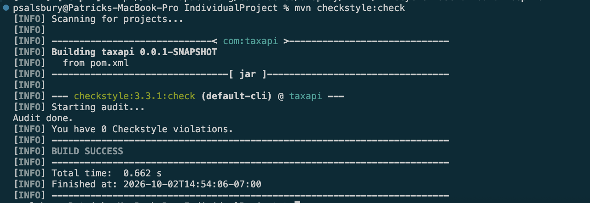
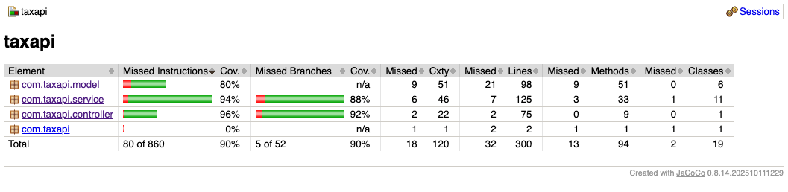
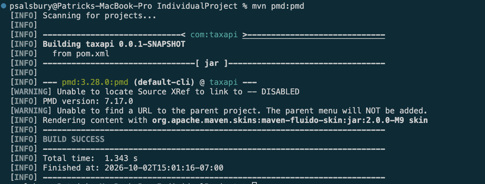
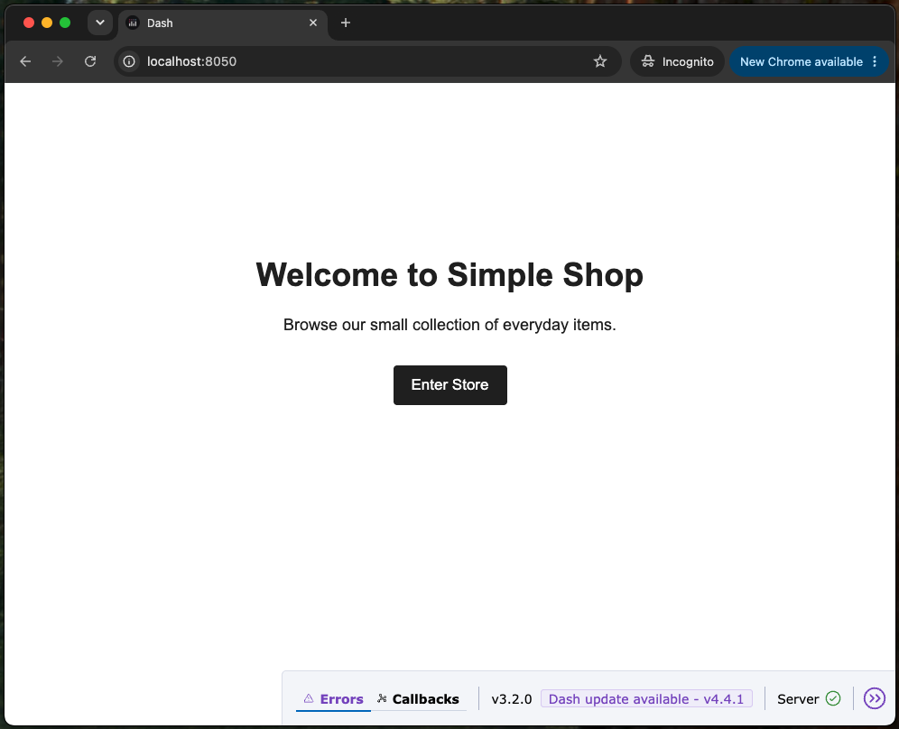
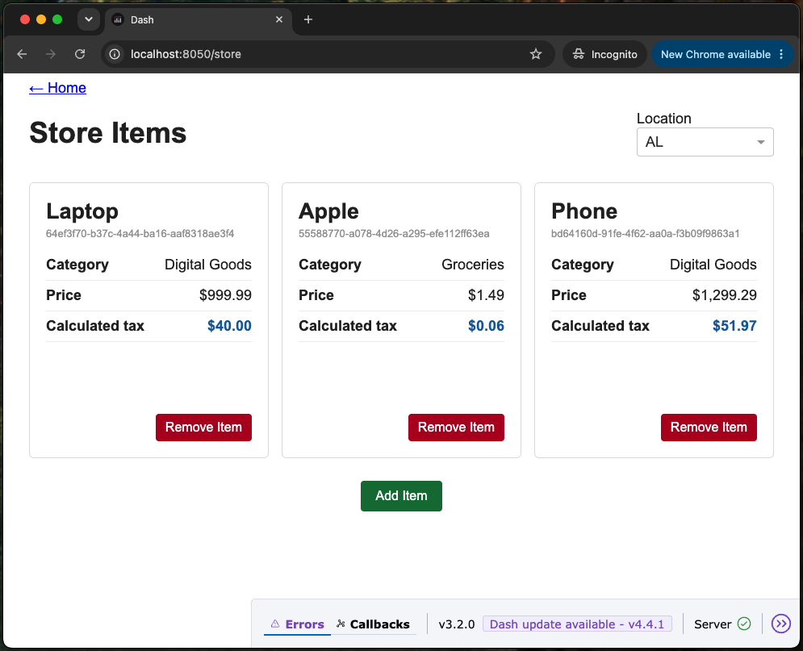

# COMS 4156 Individual Mini-Project
This is the miniproject repo for COMS4156 in Fall 2026.

## Important Information
- Honesty pledge can be outlined in `honesty.txt`
- Bugs that were identified can be located in `bugs.txt`
- Relevant references that were used can be located in `citations.txt`
- Manual testing demo (part 3): https://www.youtube.com/watch?v=nqoTY5R5T00
- Mock client testing demo (part 6): https://www.youtube.com/watch?v=R3lDAHsP8Dc
- AI usage: __CODEX__ (OpenAI) was only used for the development the API client within `/IndividualProject-client`


<hr style="height:5px; border: none; background-color: #000;">

# Endpoints

### `POST` - `/clients`
Creates a new client to register to the API. 
This operation writes to disk (clients.json) so it can persist across sessions.

##### Headers:
- Content-Type: application/json

##### Body:
- Template:
    ```
    {
        "name": "<name of client>"
    }
    ```

##### Response Codes:
- **200** = Client added successfully
- **400** = There was an error trying to perform this operation
- **409** = An existing client already exists with that name

<hr style="height: 1px; border: none; background-color: #999;">

### `POST` - `/items`
Create a new item to register to the API.
This operation writes to disk (items.json) so it can persist across sessions.

There is no duplicate detection for items with the same (name, category, basePrice) tuple, each item gets generated an ID that is used to uniquely identify correct items.

##### Headers:
- Content-Type: application/json
- X-API-key: `<API KEY>`

##### Body:
- Template:
    ```
    {
        "name": "<name of item>",
        "category": "<category of item>",
        "basePrice": <base price of item>
    }
    ```

##### Response Codes:
- **200** = Item added successfully
- **400** = There was an error trying to perform this operation
- **401** = Unauthorized to perform this action (invalid API key)


<hr style="height: 1px; border: none; background-color: #999;">

### `GET` - `/items`
Retrieve items registered to the API

##### Headers:
- X-API-key: `<API KEY>`

##### Query Parameters (optional):
- q: value used to case-insensitive, substring search on item name
    - example: `/items?q=pho`
- category: value used to case-insensitive search on item category
    - example: `/items?category=electronics`

##### Response Codes:
- **200** = Successful operation
- **400** = There was an error trying to perform this operation
- **401** = Unauthorized to perform this action (invalid API key)

##### Response Content:
JSON list of items that match the query. Result returns the item's id, name, category, and base pricei nthe order they were registered. If no items were found, an empty list is returned.


<hr style="height: 1px; border: none; background-color: #999;">

### `GET` - `/items/{id}`
Retrieve a single item registered to the API by its ID.

##### Headers:
- X-API-key: `<API KEY>`

##### Path Parameters:
- id: unique identifier of the item

##### Response Codes:
- **200** = Successful operation
- **400** = There was an error trying to perform this operation
- **401** = Unauthorized to perform this action (invalid API key)

##### Response Content:
JSON list of item that has the same item id. Result returns the item's id, name, category, and base pricei nthe order they were registered. If no items were found, an empty list is returned.

<hr style="height: 1px; border: none; background-color: #999;">

### `DELETE` - `/items/{id}`
Delete a single item registered to the API by its ID.

##### Headers:
- X-API-key: `<API KEY>`

##### Path Parameters:
- id: unique identifier of the item

##### Response Codes:
- **200** = Successful operation
- **400** = There was an error trying to perform this operation
- **401** = Unauthorized to perform this action (invalid API key)
- **404** = No item exists with that ID

<hr style="height: 1px; border: none; background-color: #999;">

### `PATCH` - `/items/{id}`
Update an item's base price by its ID. Price must be positive and non-zero.

##### Headers:
- X-API-key: `<API KEY>`
- newPrice: `<new base price>`

##### Path Parameters:
- id: unique identifier of the item

##### Response Codes:
- **200** = Successful operation
- **400** = There was an error trying to perform this operation
- **401** = Unauthorized to perform this action (invalid API key)
- **404** = No item exists with that ID

<hr style="height: 1px; border: none; background-color: #999;">

### `POST` - `/tax/quote`
Calculate tax for a quote request.

##### Headers:
- Content-Type: application/json
- X-API-key: `<API KEY>`

##### Body:
- Template 1: calculates tax for an arbitrary item given its price and category
    ```
    {
        "price": <item price>,
        "category": "<item category>",
        "state": "<state>"
    }
    ```
- Template 2: calculates tax for an already registered item in the API using its id
    ```
    {
        "id": "<item id>",
        "state": "<state>"
    }
    ```

##### Response Codes:
- **200** = Successful operation
- **400** = There was an error trying to perform this operation
- **401** = Unauthorized to perform this action (invalid API key)

##### Response Content:
JSON containing the price, tax rate, tax amount, and total.

<hr style="height: 1px; border: none; background-color: #999;">

### `GET` - `/suppported`
Provides a list of all supported tax rates.

##### Headers:
- X-API-key: `<API KEY>`

##### Response Codes:
- **200** = Successful operation
- **400** = There was an error trying to perform this operation
- **401** = Unauthorized to perform this action (invalid API key)

##### Response Content:
JSON list, each element consisting of a state and a category it supports.


<hr style="height:5px; border: none; background-color: #000;">

# Local Development
## Prerequisites
- Java 17
- Apache Maven >= 3.9

## Actions
To run server locally
- `mvn spring-boot:run`

To check style
- `mvn checkstyle:check`

To perform unit tests
- `mvn clean test`
- `open target/site/jacoco/index.html`

To perform static analysis
- `mvn pmd:pmd`


<hr style="height:5px; border: none; background-color: #000;">

# Code Validation
## Styling Checking
Maven's Checkstyle plugin was used to perform style checking, configured in pom.xml.

Command: `mvn checkstyle:check`



## Branch Coverage
Jacaco was used to perform branch analysis to ensure an overall branch coverage above 85%.

Command: `mvn clean test && open target/site/jacoco/index.html`



## Static Analysis
The static analysis tool used was PMD.

Command: `mvn pmd:pmd`


<hr style="height:5px; border: none; background-color: #000;">


# Continuous Integration
## CI Procedure
It is defined as a Github workflow in `/.github/workflows/ci.yml`

The CI pipeline runs automatically upon:
- pushes
- pull requests

The steps include:
1) Setting up Java 17
2) Installing Maven
3) Checking code style
4) Running unit tests
5) Performing static analysis

## Running CI Pipeline Locally
#### Prerequisites:
- docker
- act >= 0.2.89

#### To run:
- `act push`


<hr style="height:5px; border: none; background-color: #000;">

# API Client Application
Located in `/IndividualProject-Client`, was assisted using __CODEX__ (OpenAI) for development.

**Note:** This application isn't the main focus of this repository, so information regarding the client intentionally lacks depth.

## Preview
#### Home Page

#### Item Page


## Implementation
The client application utilizes DASH, a Python web application framework. It is built ontop of ReactJS.

## Running Locally
#### Prerequisites:
- Python >= 3.9
- Make >= 3.81

#### To Run:
Simply execute the command:
- `make run`
this command automatically handles the instantiation of the Python environment and related dependencies, then deploys the application locally at: `localhost:8050`
